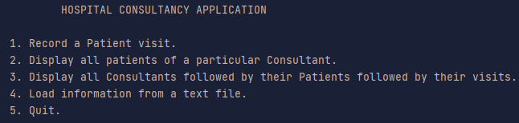
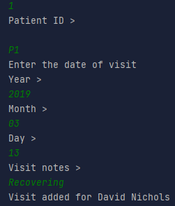

# OOP-Project-2020
A basic console program using java's FileReader.

Example of recording a patient's visit.

Running the code presents you with these options.

Select 1 and enter data. Visit is then recorded.

